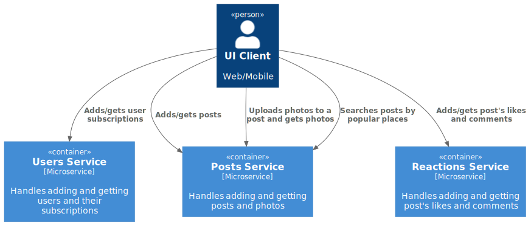

# social_network_system_design
Домашнее задание по курсу System Design:
проектирование социальной сети для путешественников.

# Функциональные требования
- публикация постов с привязкой к месту путешествия  
Каждый пост может содержать описание до 2200 символов, включая знаки препинания и пробелы,
место путешествия, а также от 1 до 10 фотографий размером не более 2 МБ каждая.
- оценка и комментарии постов других путешественников
  длина комментария не более 1500 символов
- подписка на других путешественников
- поиск популярных мест для путешествий и просмотр постов о них  
Поиск по названию места и получение связанных постов
- просмотр ленты других путешественников и ленты пользователя, основанной на подписках в обратном хронологическом порядке  
Просмотр ленты подписок, ленты пользователя - последние посты сверху.
- поддержка мобильных устройств и десктопного браузера  
Возможность работы на всех современных мобильных устройствах и десктопных браузерах

# Нефункциональные требования
- аудитория СНГ
- доступность 99,95%
- 10 000 000 DAU
- пик нагрузки приходится на июнь-август 
  - множитель сезона: х3
- данные храним всегда
- активность пользователя в среднем за день  
  - пролистывает 200 постов
  - оценивает 50 постов  
  - читает (открывает) 20 постов
  - комментирует 10 постов  
  - добавляет 0,11 постов (20 постов за 6 мес)
  - открывает 10 профилей пользователей, может смотреть их подписки и посты
  - добавляет 0,17 подписок (5 подписок в месяц)
  - делает поиск популярных мест 0,01 в день (1 раз в 3 мес)
- лимиты
  - пользователь может добавлять не более 30 постов в день  
  - пользователь может добавлять не более 1000000 подписок и иметь не более 1000000 подписчиков  
  - оценка представляет из себя лайк (других видов реакции не предусмотрено)
- тайминги  
  - создание поста 1 с  
  - добавление реакции/комментария 0,1 с  
  - добавление подписки 0,1 с  
  - поиск популярных мест 3 с  
  - получение постов пользователя 2-3 с

# Расчет нагрузки
- кол-во одновременных соединений = 10% DAU = 1 000 000
- размеры данных  
  - добавление поста = (id, user_id, текст, created_at, место) = 8 + 8 + 2200 + 8 + 256 = 2,7 КБ  
    У меня нет опыта разработки геосервиса, поэтому место - это просто строка (хотя понимаю, что неэффективно)
  - добавление фотографии = (id, image, created_at, post_id, user_id) = 8 Б + 2 МБ + 8 Б + 8 Б + 8 Б ~ 2 МБ  
    Фото нельзя добавить без поста. Пользователь начинает создавать пост и добавляет в него фотографии.
  - добавление реакции = (id, user_id, post_id, created_at) =  8 + 8 + 8 + 8 = 24 Б
  - добавление комментария = (id, user_id, post_id, текст, created_at) = 8 + 8 + 8 + 1500 + 8 ~ 1,5 КБ  
  - добавление подписки = (id, following_user_id, followed_user_id, created_at) = 8 + 8 + 8 + 8 = 32 Б  
  
  - получение поста = (id, user_id, текст, created_at, место, likes_count, [id фотографий]) = 8 + 8 + 2200 + 8 + 512 + 8 + 8 * 10 = 2,7 КБ  
    За один запрос получаем 20 постов, т.е. 2,7 КБ * 20 = 54 КБ
  - получение фотографии = (id, image, created_at, post_id, user_id, image_preview_url, image_url) = 8 Б + 2 МБ + 8 Б + 8 Б + 8 Б + 35 Б + 35 Б ~ 2 МБ
  - получение реакций для поста = (id, post_id, likes_count) = 8 + 8 + 8 = 24 Б
  - получение комментариев для поста = (id, post_id, count, [user_id, comment_text, created_at]) = 8 + 8 + 8 + (8 + 1500 + 8) ~ 1,5 КБ  
    За один запрос получаем 10 комментариев, т.е. 1,5 КБ * 10 = 15 КБ
  - получение подписок пользователя = (id, user_id, count, [following_user_id]) = 8 + 8 + 8 + 8 = 32 КБ
  - поиск популярных мест = (id, user_id, search_text, [post_ids]) = 8 + 8 + 256 + 8 * 20 = 432 Б  
    За один запрос получаем 20 постов
### Запись (write)
- посты
  - RPS = 10 000 000 DAU * 0,11 / 86400 = 13
  - трафик = 13 * 2,7 КБ ~ 35 КБ/с
- фотографии
  пользователь добавляет 10 фотографий к посту, а постов добавляет 0,11 в день
  - RPS = 10 000 000 DAU * 0,11 * 10 / 86400 = 128
  - трафик = 128 * 2 МБ = 256 МБ/с
- реакции
  - RPS = 10 000 000 DAU * 50 / 86400 = 579
  - трафик = 579 * 24 Б = 14 КБ/с
- комментарии
  - RPS = 10 000 000 DAU * 10 / 86400 = 1158
  - трафик = 1158 * 1,5 КБ = 1,7 МБ/с
- подписки
  - RPS = 10 000 000 DAU * 0,17 / 86400 = 20
  - трафик = 20 * 32 Б = 640 Б/с

### Чтение (read)
- посты (пролистываем)
  - RPS = 10 000 000 DAU * 200 / 86400 = 23148
  - трафик = 23148 * 54 КБ = 1221 МБ/с
- посты (читаем)
  - RPS = 10 000 000 DAU * 20 / 86400 = 2315
  - трафик = 2315 * 54 КБ = 125 МБ/с
- фотографии (получаем столько же раз, сколько читаем постов)
  - RPS = 10 000 000 DAU * 20 * (10 фото в посте) / 86400 = 23148
  - трафик = 23148 * 2 МБ = 46 ГБ/с
- реакции (получаем столько же раз, сколько пролистываем постов)
  - RPS = 10 000 000 DAU * 200 / 86400 = 23148
  - трафик = 23148 * 24 Б = 543 КБ/с
- комментарии (получаем столько же раз, сколько читаем постов)
  - RPS = 10 000 000 DAU * 20 / 86400 = 2315
  - трафик = 2315 * 15 КБ = 34 МБ/с
- подписки
  - RPS = 10 000 000 DAU * 10 / 86400 = 1158
  - трафик = 1158 * 32 КБ = 37 МБ/с
- поиск популярных мест
  - RPS = 10 000 000 DAU * 0,01 / 86400 = 1,2
  - трафик = 1,2 * 432 Б = 519 Б/с

# Расчет дисков на 1 год
- посты
    - IOPS = 23161 (HDD - 232 | SSD - 24 | nVME - 3)   // сумма RPS w+r
    - Throughput = 1221 МБ/с (HDD - 13 | SSD - 3 | nVME - 1)   // сумма трафика w+r
    - Capacity = 35 КБ/с * 86400 * 365 = 1 ТБ (HDD - 1 | SSD - 1 | nVME - 1)
    - Итого HDD - 232 | SSD - 24 | nVME - 3
- фотографии
    - IOPS = 23276 (HDD - 233 | SSD - 24 | nVME - 3)
    - Throughput = 46,3 ГБ/с (HDD - 463 | SSD - 93 | nVME - 16)
    - Capacity = 256 МБ/с * 86400 * 365 = 7700 ТБ (HDD - 241 | SSD - 77 | nVME - 257)
    - Итого HDD - 463 | SSD - 93 | nVME - 257
- реакции
    - IOPS = 23727 (HDD - 238 | SSD - 24 | nVME - 3)
    - Throughput = 543 КБ/с (HDD - 1 | SSD - 1 | nVME - 1)
    - Capacity = 14 КБ/с * 86400 * 365 = 431 ГБ (HDD - 14 | SSD - 5 | nVME - 15)
    - Итого HDD - 238 | SSD - 24 | nVME - 15
- комментарии
    - IOPS = 3473 (HDD - 35 | SSD - 4 | nVME - 1)
    - Throughput = 36 МБ/с (HDD - 1 | SSD - 1 | nVME - 1)
    - Capacity = 1,7 МБ/с * 86400 * 365 = 51 ТБ (HDD - 2 | SSD - 1 | nVME - 2)
    - Итого HDD - 35 | SSD - 4 | nVME - 2
- подписки
    - IOPS = 1178 (HDD - 12 | SSD - 2 | nVME - 1)
    - Throughput = 37 МБ/с (HDD - 1 | SSD - 1 | nVME - 1)
    - Capacity = 640 Б/с * 86400 * 365 = 19 ГБ (HDD - 1 | SSD - 1 | nVME - 1)
    - Итого HDD - 12 | SSD - 2 | nVME - 1
- поиск популярных мест
    - IOPS = 1,2 (1 HDD)
    - Throughput = 519 Б/с (1 HDD)
    - Capacity = ничего не храним
    - Итого HDD - 1
  
Для фотографий большой трафик, IOPS и хранение, выберем HDD. Операции будут выполняться с задержкой,  
но в дальнейшем будем использовать кэширование.
Стоимость = (463 HDD * 32 ТБ / 6) * $100 = $247 000

Для постов большое значение IOPS и небольшое хранение.  
Самым дешевым вариантом будет nVME.  
Самым эффективным по хранению будет HDD, но отказываемся из-за цены.  
(232 HDD * 32 ТБ / 6) * $100 = $123 734  
(24 SSD * 100 ТБ / 6) * $200 = $80 000  
(3 nVME * 30 ТБ / 6) * $500 = $7500   останавливаемся на этом варианте

Для реакций аналогично постам.   
Для комментариев, подписок выбираем SSD, чтобы выиграть в скорости, т.к. разница по цене с HDD здесь небольшая.

# Распределенное хранение
Изначально у меня было 10000 DAU, но для наглядности в этом разделе пришлось увеличить до 10 000 000 DAU,
что также привело к перерасчету RPS, трафика, оценки дисков
- репликация  
  Для всех подсистем, кроме изображений:  
  стратегия репликации master-slave с фактором репликации = 3.  
  Конфигурация кластера и синхронизация: один slave hot-standby sync, 2ой slave warm-standby async  
  для отказоустойчивости, чтобы иметь возможность быстро переключиться.  
  Если держать 2 синхронные реплики, будут сильные задержки, поэтому одну реплику делаем асинхронной.  
  Вид синхронизации: логическая (копируются записи).  

  Для изображений делаем master-slave с фактором репликации = 2 (из-за большого количества дисков).  
  Для слейва используем warm-standby async, т.к. у нас нет второй реплики и необходимо обеспечить надежное хранение данных.
  Однако в этой схеме чтение будет только с master.  
  Вид синхронизации: логическая.
- шардирование  
  key-based  
  Для всех подсистем, кроме профиля пользователя (при получении подписок и постов пользователя)  
  в качестве ключа шардирования используем post_id.  
  Для профиля используем user_id.  
  Поиск не шардируем и не реплицируем (ничего не храним).
- количество хостов  
  Выбираем те же типы дисков, что и в системе с одним хостом, по причине цены. 

  фотографии:  
  hosts = 463 HDD / 2 = 232  
  hosts with replication = 232 * 2 = 464  

  посты:  
  hosts = 3 nVME / 2 = 2  
  hosts with replication = 2 * 3 = 6  

  реакции аналогично постам  
  hosts = 3 nVME / 2 = 2  
  hosts with replication = 2 * 3 = 6

  комментарии  
  hosts = 4 SSD / 2 = 2  
  hosts with replication = 2 * 3 = 6

  подписки  
  hosts = 2 SSD / 2 = 1  
  hosts with replication = 1 * 3 = 3

# Верхнеуровневое проектирование системы
Визуализация с помощью [C4 model](https://c4model.com/)

     <b>Level 1.</b> System context diagram  

  

